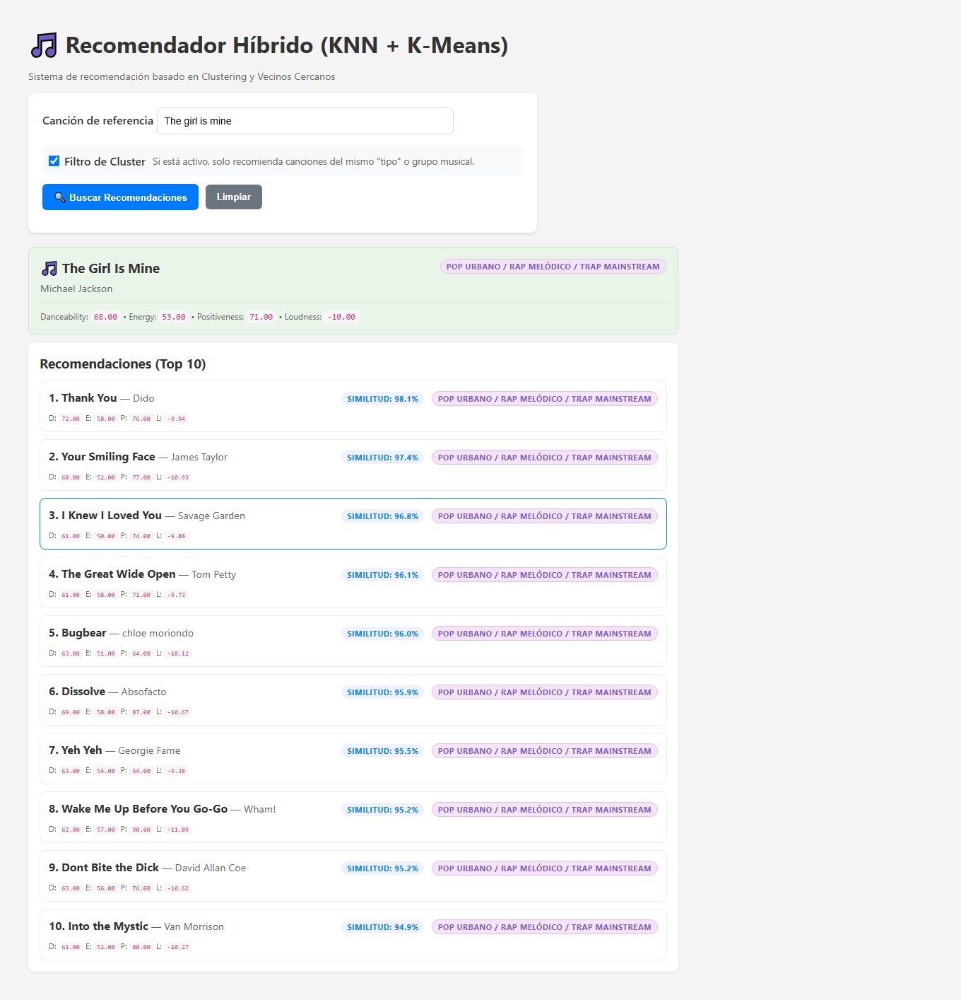
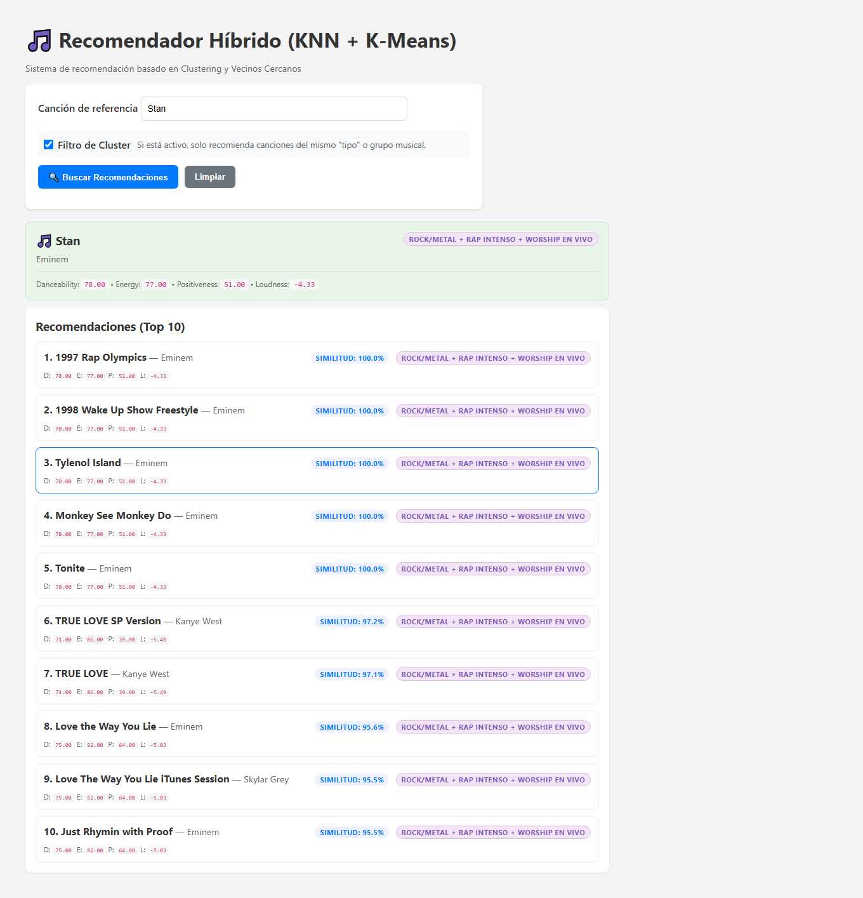
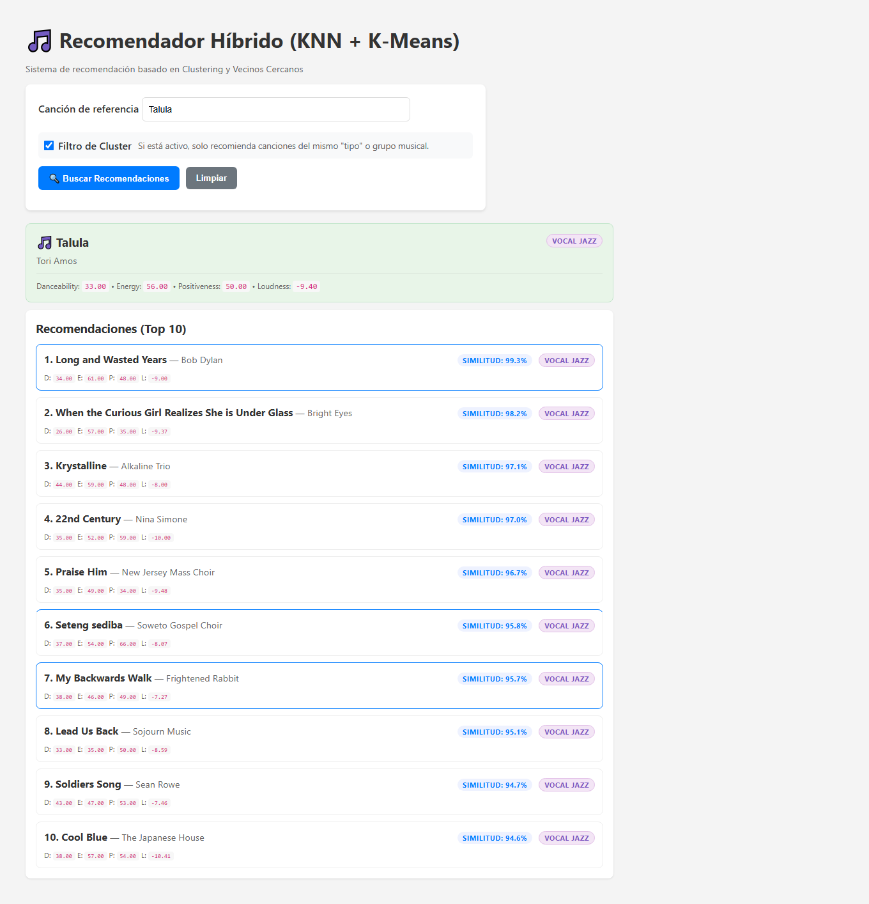
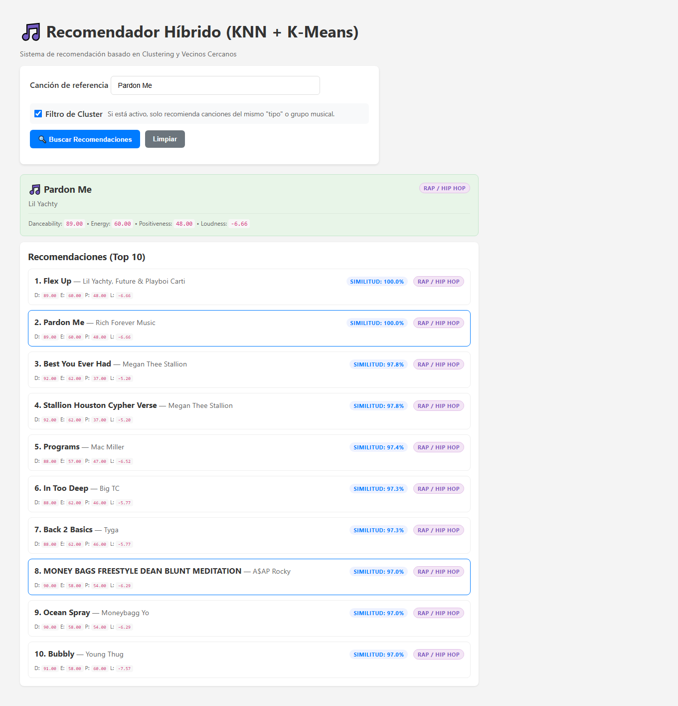
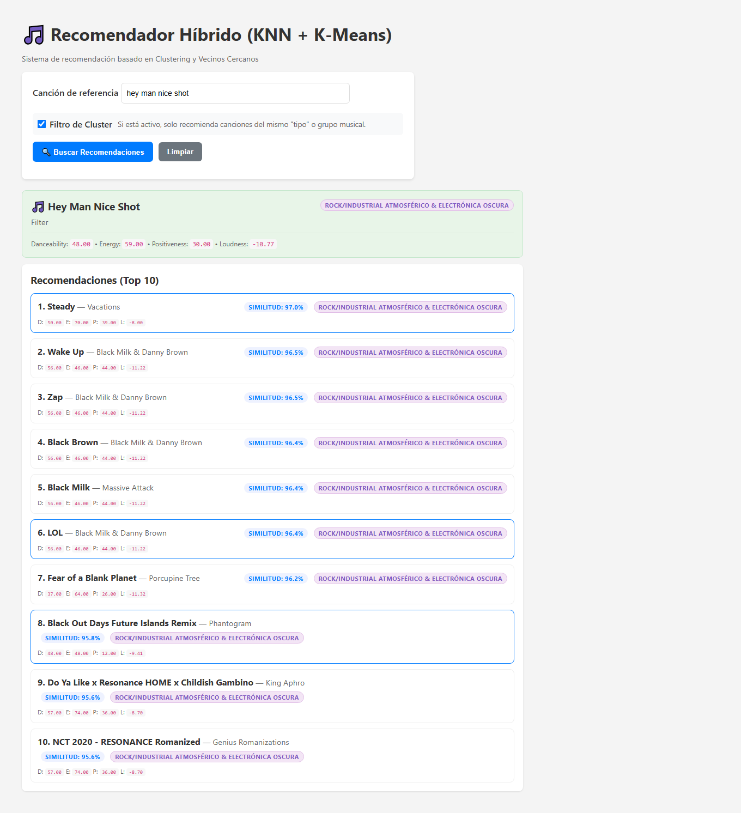
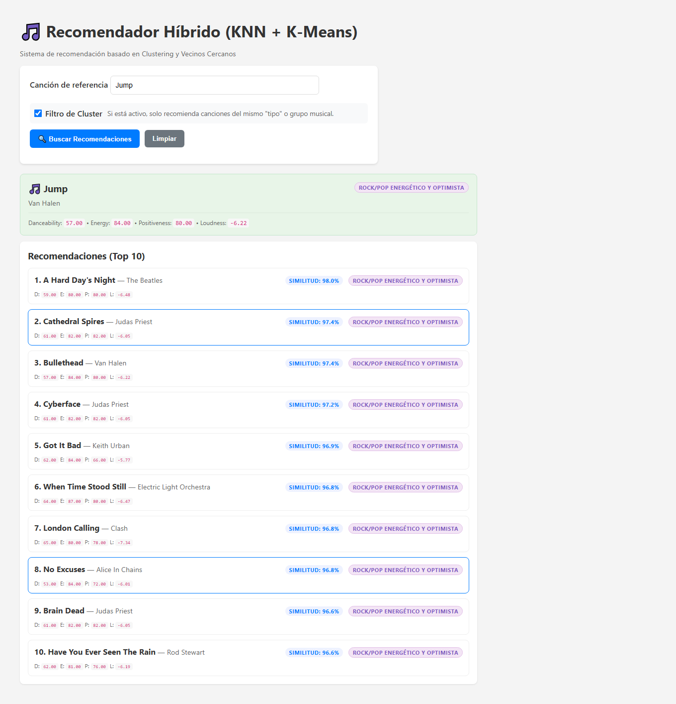

# Ejemplos
---
## 1. Pop Urbano / Rap Melódico / Trap Mainstream

## 2. Rock/Metal + Rap Intenso + Worship en vivo

## 3. Vocal Jazz

## 4. Rap / Hip Hop

## 5. Rock/Industrial Atmosférico & Electrónica Oscura

## 6. Rock/Pop Energético y Optimista

---