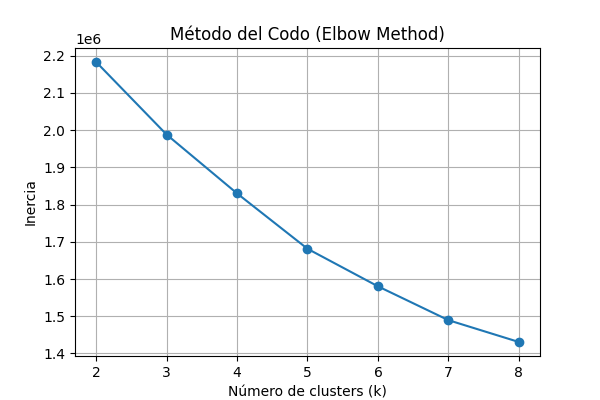
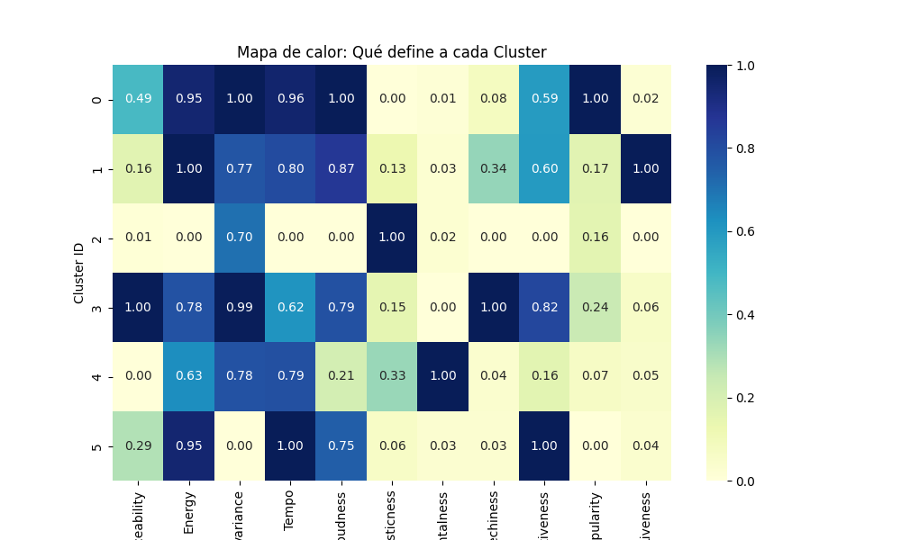

# Detalle del Script de Entrenamiento

Este script, denominado `train_model.py`, realiza el entrenamiento de tres componentes clave para crear un sistema de recomendación híbrido basado en 11 características de audio de Spotify.

## 1. Carga y Preprocesamiento de Datos (Pasos 1-3)

Esta etapa asegura que los datos están limpios y en el formato correcto para los modelos.

* **Carga del Dataset:** El script carga el dataset de Spotify desde una ruta absoluta específica.
* **Definición de Features:** Se identifican **11 características numéricas** clave (`feature_cols`) de audio, como **Danceability**, **Energy**, **Loudness**, **Tempo**, **Positiveness** (Valence), etc., que describen el perfil musical de cada canción.
* **Limpieza:** Se eliminan filas que contengan valores nulos (`NaN`) en las columnas necesarias.
* **Escalado de Features:** Se utiliza **StandardScaler** para estandarizar las 11 características. Esto es esencial para algoritmos basados en distancias (KNN y K-Means), asegurando que todas las *features* contribuyan equitativamente a la medición de la similitud.
* **Preparación de Matrices:**
    * `X_dense`: Matriz densa para K-Means y Naive Bayes.
    * `X`: Matriz dispersa (`csr_matrix`) optimizada para el modelo NearestNeighbors (KNN).

---

## 2. Modelos de Machine Learning (Pasos 4-6)

### 2.1. Recomendación por Similitud (NearestNeighbors - KNN)

Este es el **motor de similitud** del sistema.

* **Algoritmo:** **NearestNeighbors** (Vecinos más Cercanos).
* **Features:** Utiliza las 11 *features* escaladas (`X`).
* **Métrica:** Se elige la **Distancia Coseno** (`metric='cosine'`), que mide la similitud angular entre vectores de canciones, ideal para encontrar temas con patrones de audio similares.
* **Propósito:** Proporcionar una lista de canciones más cercanas a una canción de entrada.

### 2.2. Agrupamiento de Estilos (K-Means Clustering)

Este componente clasifica las canciones en categorías de "estilo" o "género" basadas en sus atributos de audio.

* **Método del Codo:** Se ejecuta un bucle para calcular la **Inertia**  para diferentes números de clusters (`k`), generando un gráfico para ayudar a determinar visualmente el valor óptimo de `k`.

* **Clustering Final:** Se entrena el modelo **KMeans** con un valor elegido (`k_opt = 6`).
* **Asignación:** A cada canción del DataFrame se le asigna un **ID de cluster** (`df["cluster"]`), representando su categoría de estilo.
* **Análisis:** Se imprime el perfil promedio de las 11 *features* para cada cluster, lo que ayuda a interpretar qué tipo de música representa cada grupo (ej: "Cluster 0" = Alta Energía, Bajo Tempo).

### 2.3. Clasificador de Clusters (Gaussian Naive Bayes)

Este modelo aprende a predecir el cluster al que pertenece una canción basándose únicamente en sus 11 características de audio.

* **Función:** Clasifica las canciones en los `k=6` clusters creados por K-Means.
* **Entrenamiento:** Se entrena con las **features escaladas** (`X_dense`) como entrada y el **ID del cluster** (`y`) como etiqueta.
* **Evaluación:** Se calcula el **Accuracy** y se genera la **Matriz de Confusión** y el **Reporte de Clasificación**, indicando la eficacia del modelo para replicar las asignaciones de K-Means.

---

## 3. Lógica y Persistencia

### 3.1. Funciones de Recomendación (Uso Híbrido)

El script incluye funciones Python que encapsulan la lógica para ser usadas por la API:

* `crea_vector_caracteristicas`: Toma una canción, aplica el `scaler` entrenado y la convierte en un vector de features listo para KNN.
* `recomendar_por_nombre_cancion`: La función principal que:
    1.  Busca la canción semilla.
    2.  Obtiene su **cluster ID**.
    3.  Llama al modelo **KNN** para obtener vecinos cercanos.
    4.  **Aplica el filtro híbrido:** Por defecto (`same_cluster=True`), solo devuelve las recomendaciones que pertenecen al **mismo cluster** que la canción semilla. Esto combina la precisión de la similitud (KNN) con la coherencia de estilo (K-Means).

### 3.2. Guardado de Artefactos

Este es el paso final que permite que la API de FastAPI funcione sin necesidad de reentrenar.

* **Artefactos:** Se empaquetan y guardan **todos** los objetos necesarios en el archivo `music_recommender_with_clusters.joblib` usando `joblib.dump()`.
    * `knn_model`: El modelo de recomendación.
    * `scaler`: El transformador necesario para escalar las nuevas entradas.
    * `kmeans_model`: El modelo de clustering.
    * `naive_bayes_model`: El clasificador de clusters.
    * `track_index`: El DataFrame original con las canciones y los clusters asignados.

---

Este sistema permite ofrecer recomendaciones que no solo son similares en audio, sino que también pueden estar **filtradas por un tipo de música coherente**, lo cual mejora la experiencia del usuario.