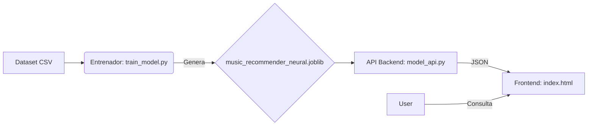

# Trabajo Práctico Machine Learning - Recomendador Musical con Redes Neuronales
# Grupo 1 - 25/11/2025

## Integrantes
- Macías, Juliana
- Cortés Cid, Francisco
- Moreno, Nahuel
- Teixido, Leonardo

---
# Sistema de Recomendación de Música con Redes Neuronales

Este proyecto es una solución **Full-Stack de Machine Learning** diseñada para recomendar canciones de Spotify. A diferencia de los sistemas tradicionales, este proyecto utiliza **Deep Learning (Autoencoders)** para comprimir las características complejas de audio en un espacio latente (Embeddings) y calcular similitudes matemáticas entre canciones.

El sistema se compone de tres módulos integrados:

1.  **Entrenador (Model Trainer):** Procesa datos y crea la Red Neuronal.
2.  **API (Backend):** Expone el modelo inteligente a través de HTTP.
3.  **Frontend (Cliente Web):** Interfaz gráfica para buscar y visualizar recomendaciones.

-----

##  Arquitectura del Sistema

El flujo de datos funciona de la siguiente manera:



1.  **Entrenamiento:** Se analizan características como `Danceability`, `Energy`, `Tempo`. Se entrena un Autoencoder para reducir dimensiones y K-Means para agrupar géneros.
2.  **Serialización:** Todo el conocimiento (modelos, vectores, datos) se guarda en un archivo `.joblib`.
3.  **Servicio:** La API carga este archivo en memoria RAM para responder consultas en milisegundos.
4.  **Consumo:** El usuario interactúa con la página web, que solicita recomendaciones a la API.

-----

## Guía de Inicio Rápido

Seguir estos pasos en orden para levantar el proyecto completo.

### 1\. Prerrequisitos

Asegurarse de tener instalado Python 3.8+ y las siguientes librerías:

```bash
pip install pandas numpy scikit-learn tensorflow joblib fastapi uvicorn matplotlib
```

### 2\. Entrenamiento del Modelo (Backend - Paso 1)

Antes de levantar el servidor, se necesita generar el "cerebro" del sistema.

1.  Abrir una terminal en la carpeta del proyecto.
2.  Ejecutar el script de entrenamiento:
    ```bash
    python train_model.py
    ```
3.  **Resultado:** Al finalizar, se creará el archivo `music_recommender_neural.joblib`.

### 3\. Iniciar la API (Backend - Paso 2)

Una vez generado el archivo `.joblib`, se levanta el servidor FastAPI.

1.  En la misma terminal, ejecutar:
    ```bash
    uvicorn model_api:app --reload --port 8090
    ```
2.  **Resultado:** Se verá un mensaje indicando que el servidor está corriendo en `http://127.0.0.1:8090`.
      * *Nota: Se puede verificar el estado entrando a `http://127.0.0.1:8090/health`*.

### 4\. Usar la Aplicación (Frontend)

1.  Localizar el archivo `index.html` en la carpeta.
2.  **Opción recomendada:** Abrirlo con "Live Server" en VS Code.
3.  **Opción simple:** Hacer doble clic en el archivo para abrirlo en el navegador.
4.  **Uso:**
      * Escribir una canción (ej: "Shape of You").
      * Hacer clic en "Buscar Recomendaciones".
      * Explorar las canciones similares y sus métricas visuales.

-----

## Características Técnicas

### Inteligencia Artificial (Autoencoder)

Se utiliza una red neuronal que aprende a comprimir 11 características de audio en un vector de 6 dimensiones. Esto permite capturar la "esencia" de la canción mejor que los datos crudos.

### Clustering Semántico

Cada canción es asignada a un grupo con nombre interpretable mediante el algoritmo **K-Means**:

  * *Mainstream Hits*
  * *Live Energy*
  * *Acoustic Chill*
  * *Urban Dance*
  * *Instrumental Focus*
  * *Happy Upbeat*

### Búsqueda Vectorial

La API no realiza comparaciones simples; calcula la **Distancia Euclidiana** en el espacio latente generado por la red neuronal, permitiendo encontrar canciones que "suenan parecido" matemáticamente.

-----

## Estructura de Archivos

```text
📁 Proyecto/
├── dataset/light_spotify_dataset.csv   # Fuente de datos
├── train_model.py                      # Script de entrenamiento (ML)
├── model_api.py                        # Servidor API (FastAPI)
├── index.html                          # Interfaz de Usuario (Frontend)
├── music_recommender_neural.joblib     # Artefacto generado (Modelo serializado)
└── README.md                           # Esta documentación
```

## Solución de Problemas

  * **Error: "Artefactos incompletos" en la API:**
      * Asegurarse de haber corrido `train_model.py` primero para generar el archivo `.joblib` actualizado
  * **Error: "Failed to fetch" en el Frontend:**
      * Verificar que la API esté corriendo en el puerto **8090**. Si la API corre en otro puerto (ej: 8000), editar la variable `API_BASE` dentro del archivo `index.html`.
  * **TensorFlow no instalado:**
      * La API puede funcionar sin TensorFlow para recomendaciones básicas, pero lo necesita si se quiere usar el encoder para canciones nuevas fuera del dataset.