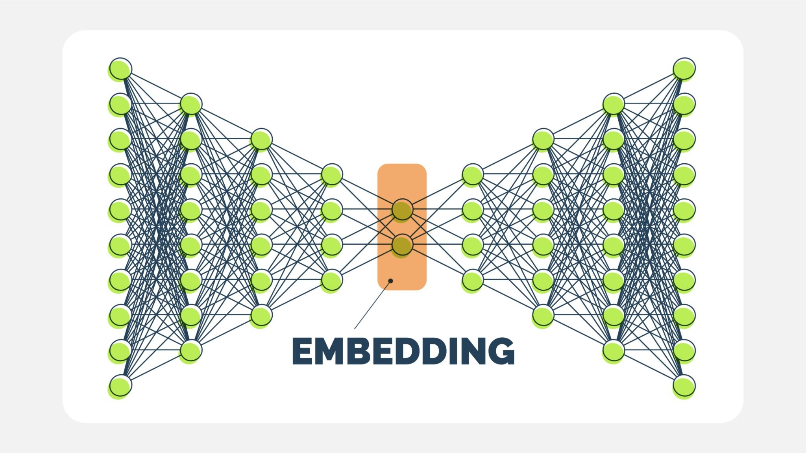
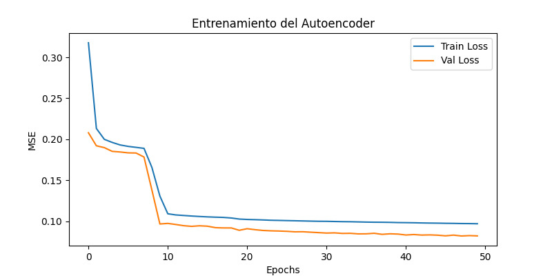

# Documentación del Entrenador de Modelo Neuronal (Spotify Recommender)

Este script (`train.py`) es el corazón del sistema de recomendación. Su función es procesar el dataset de canciones, entrenar una **Red Neuronal (Autoencoder)** para entender la "esencia" de cada canción y generar los archivos necesarios para que la API funcione.

## Flujo de Trabajo del Script

El proceso se divide en 7 pasos secuenciales:

### 1\. Carga y Preparación de Datos

  * **Qué hace:** Lee el archivo `.csv` con los datos de Spotify.
  * **Validación:** Verifica que existan las columnas críticas como `Danceability`, `Energy`, `Tempo`, etc.
  * **Limpieza:** Elimina cualquier canción que tenga datos vacíos (nulos) para evitar errores matemáticos.

### 2\. Preprocesamiento (Scaling)

  * **Tecnología:** `StandardScaler` de Scikit-Learn.
  * **Por qué:** Las redes neuronales son sensibles a la escala de los números. No es lo mismo el *Tempo* (ej. 120 BPM) que la *Acousticness* (ej. 0.05).
  * **Resultado:** Transforma todos los valores para que tengan una media de 0 y una desviación estándar de 1, poniendo todas las características en igualdad de condiciones.

### 3\. Clustering (Etiquetado Humano)

  * **Tecnología:** K-Means.
  * **Objetivo:** Agrupar las canciones en 6 "familias" o clusters basados en sus similitudes.
  * **Naming:** Asigna nombres interpretables a cada grupo para mostrar en el Frontend:
	  * *Pop Urbano / Rap Melódico / Trap Mainstream*
	  * *Rock/Metal + Rap Intenso + Worship en vivo*
	  * *Vocal Jazz*
	  * *Rap / Hip Hop*
	  * *Rock/Industrial Atmosférico & Electrónica Oscura*
	  * *Rock/Pop Energético y Optimista*

### 4\. Red Neuronal (Autoencoder)

Este es el cerebro del recomendador. Utilizamos una arquitectura de **Autoencoder**.



  * **Entrada (11 Neuronas):** Recibe las características de la canción (Energy, Danceability, etc.).
  * **Encoder (Compresión):** Reduce la información a un "Espacio Latente" de 6 dimensiones.
  * **Botella de Cuello (Embeddings):** Es la capa central. Aquí es donde la red aprende la "esencia" comprimida de la canción.
  * **Decoder (Reconstrucción):** Intenta recrear los datos originales a partir de la versión comprimida.
  * **Entrenamiento:** La red se entrena intentando que la *Salida* sea igual a la *Entrada*, minimizando el error (MSE).



### 5\. Generación de Embeddings

  * Una vez entrenada la red, descartamos la parte del "Decoder".
  * Nos quedamos solo con el **Encoder**.
  * Pasamos todas las canciones por el Encoder para obtener vectores matemáticos (embeddings) que representan cada canción en un espacio vectorial avanzado.

### 6\. Guardado de Artefactos (`.joblib`)

Este paso es crítico para la integración con la API (`FastAPI`). Se guarda un archivo `music_recommender_neural.joblib` que contiene un diccionario con:

| Clave | Descripción | Uso en API |
| :--- | :--- | :--- |
| `scaler` | Objeto para escalar datos | Normalizar nuevas búsquedas. |
| `kmeans_model` | Modelo de clustering | Asignar cluster a nuevas canciones. |
| `encoder_model` | La mitad de la red neuronal | Convertir nuevas canciones a vectores. |
| `embeddings` | Matriz de vectores | Calcular distancias matemáticas rápido. |
| `dataframe_data` | **Base de datos enriquecida** | Contiene Song, Artist, Cluster, **Danceability, Energy...** (Vital para graficar en Frontend). |

### 7\. Smoke Test

  * Realiza una prueba rápida en consola.
  * Pide una canción, busca su vector, calcula la **Distancia Euclidiana** contra todas las demás y muestra las 5 más cercanas para verificar que la lógica funciona.

-----

## Cómo ejecutarlo

Asegurarse de tener las librerías instaladas (`pandas`, `numpy`, `tensorflow`, `scikit-learn`, `joblib`, `matplotlib`) y ejecutar:

```bash
python train_model.py
```

Al finalizar, se verá el mensaje:

> `Saved: music_recommender_neural.joblib`